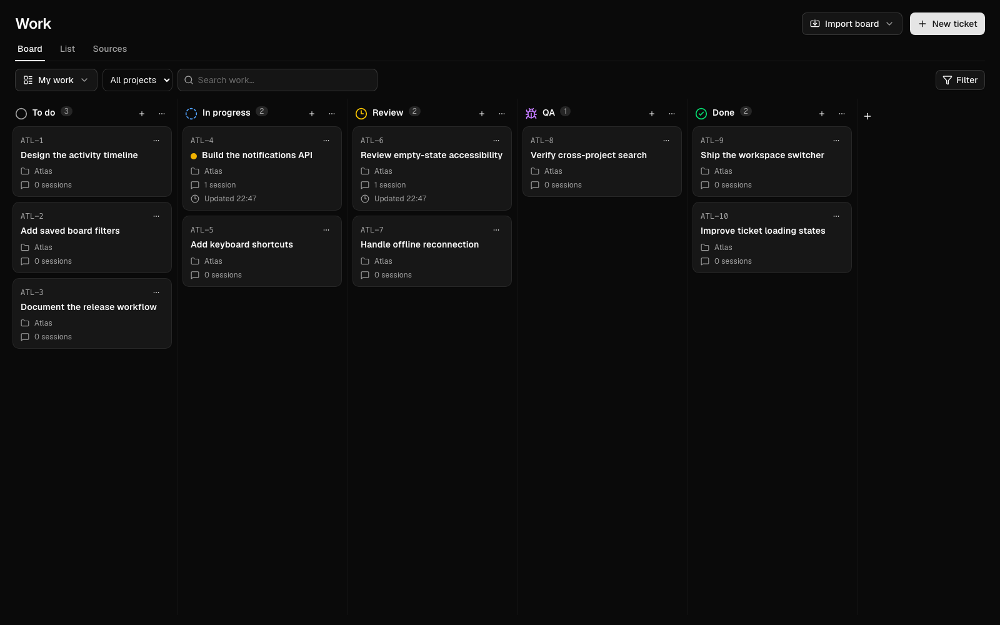
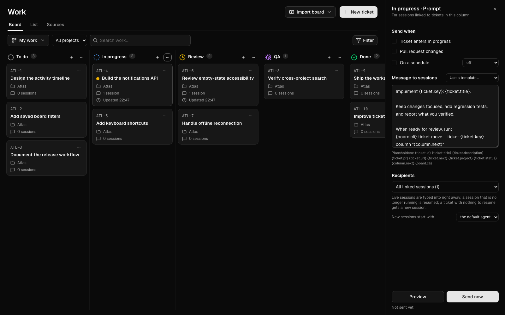
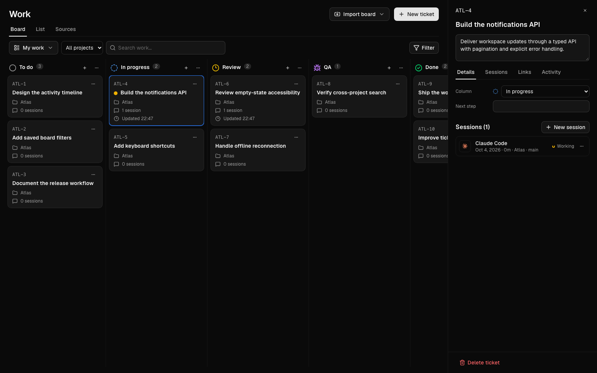
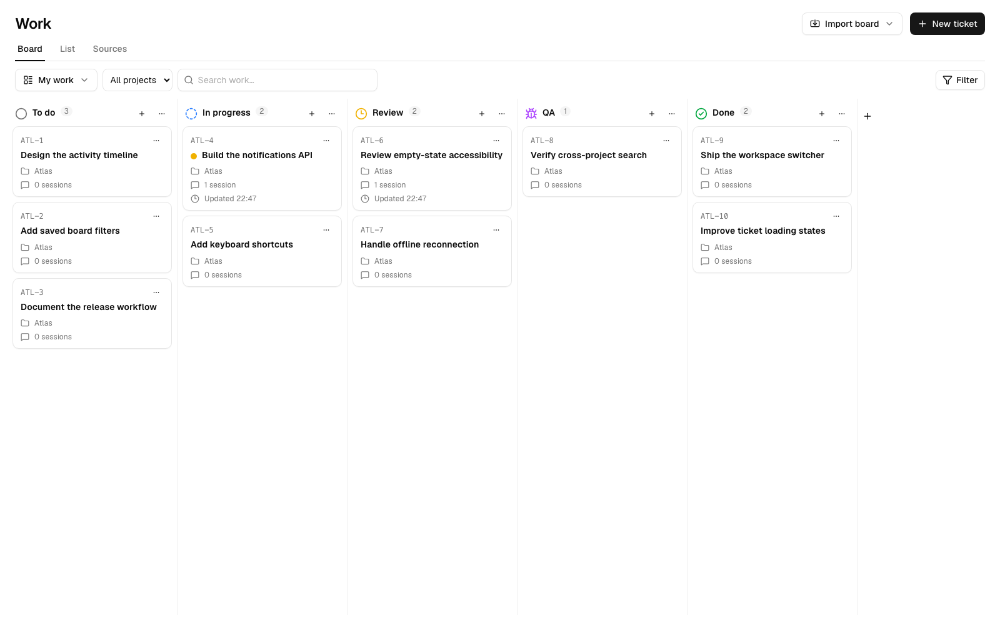

<div align="center">

# Orca Kanban

**Your tickets. Your agents. One board.**

A local-first Kanban plugin for [Orca](https://onorca.dev), with agent sessions,
column prompts, and Jira, Linear, and GitHub integrations.

[Get started](#get-started) · [How it works](#how-it-works) · [Screenshots](#screenshots) · [Development](#development)

</div>



## A board that works with your agents

- **Make work visible.** Create tickets, customize columns, drag cards between stages, and switch between board and list views.
- **Keep sessions attached to tickets.** Link existing Orca terminals or start an agent in a dedicated worktree. Open a linked session without hunting through tabs.
- **Give every stage its instructions.** Send a column's prompt when a ticket enters it, on a cron schedule, when its pull request changes, or manually.
- **Bring your issue tracker.** Import Jira boards, Linear teams, and GitHub Projects or repositories. Work with sprints, cycles, and iterations; review pending changes before pushing them upstream.
- **Keep your board local.** A standalone Rust service stores board data in SQLite and serves the UI inside an Orca browser tab. No separate hosted board account is required.

> Early release · Validated on macOS Apple Silicon with Orca 1.4.209.
> Orca's plugin API is experimental. Other Orca versions and operating systems
> are not yet verified. This is an independent community plugin, not an official Orca product.

## Get started

### Install from a Git URL — macOS Apple Silicon

No Node.js, Rust, or local compilation is required for this distribution.
In **Orca → Settings → Plugins → Install plugin → Git URL**, paste:

```text
https://github.com/clioo/orca-kanban.git#macos-arm64-v0.2.0
```

Click **Install**, review the permissions, then enable the plugin. Press
**Command + J** and run **Open Work board**.

The `#macos-arm64-v0.2.0` tag contains the compiled plugin at the repository
root. The default `main` branch contains source code and is **not** directly
installable. Keep the `#tag` suffix: Orca requires a pinned tag or commit.
This package is for M-series Macs only, not Intel Macs, Windows, or Linux.
Each laptop keeps its own local board; installing does not transfer another
machine's tickets, credentials, or agent sessions.

### Build from source — requirements

- Orca installed at `/Applications/Orca.app`, with plugins enabled.
- Node.js 24 and pnpm 11.19.0 on your `PATH`.
- A current stable Rust toolchain, including Cargo, rustfmt, and Clippy.
- Xcode Command Line Tools for native compilation and `codesign`.
- An installed, configured agent CLI if you want to launch agent sessions.

### Build and install

```sh
git clone https://github.com/clioo/orca-kanban.git
cd orca-kanban
pnpm --dir web install --frozen-lockfile
./scripts/package-plugin.sh
```

1. Open **Orca → Settings → Plugins → Install plugin**.
2. Select the generated **`dist/clioo.work-board`** folder.
3. Review the requested permissions and enable the plugin.
4. Press **Command + J**, search for **Open Work board**, and run it.

The board opens in an Orca browser tab. To update, build again and install the
same folder. The plugin ID remains `clioo.work-board` so existing installations
keep their data.

### Try it safely

1. Create a ticket in **My work** and drag it between columns.
2. Reload the tab to check that its position persists.
3. Open the ticket and link an existing session, or create a new one.
4. Open a column's **Configure prompt…** menu and write a short instruction.
5. Use **Preview** to inspect the message, then **Send now** to deliver it.

**Agent launches can consume your provider quota.** Creating an issue on an
imported board writes to the real provider; **Push** sends pending changes
upstream. Start with local tickets if you are just exploring.

## How it works

```text
Orca plugin worker
  ├── starts the local service
  ├── forwards agent events
  └── opens the board in an Orca browser tab
          │
          ▼
React UI ── HTTP RPC ── Rust service ── SQLite
                           │
                           ├── Orca CLI: worktrees, terminals, agent state
                           └── Jira / Linear / GitHub: import, sync, push
```

The service listens on `127.0.0.1` and stores its data under:

```text
<Orca user data>/plugins-data/clioo.work-board/
```

Column schedules and source sync can continue between board visits. The service
stops when the plugin is disabled or removed; updates attempt to reuse its port.
It does not require another desktop application to run.

### Column prompts

Use ticket and column placeholders to keep instructions reusable:

```text
Implement {ticket.key}: {ticket.title}.

Keep changes focused, add regression tests, and report what you verified.

When ready for review, run:
{board.cli} ticket move --ticket {ticket.key} --column "{column.next}"
```

`{board.cli}` expands to the shell-quoted path of the board's command-line
launcher. Agents can inspect tickets, move them, and call the service's RPC:

```sh
work-board ticket show ATL-4
work-board ticket move --ticket ATL-4 --column "Review"
work-board board
work-board rpc work.sources
```

Use the generated launcher's full path outside a column prompt; `work-board`
is not automatically added to your shell's `PATH`.

### Agent sessions

Launches use Orca's agent settings. Claude sessions started by the board retain
an explicit conversation ID for exact resume. Other supported agents, and
Claude sessions created outside the board, continue the folder's latest
conversation instead. When Orca cannot be reached, session state is reported as
unverifiable rather than assumed exited.

### Sources

Connect providers in **Sources**, import a board, and choose the Orca project
its agents should work in. Supported flows include source synchronization,
pending local moves, conflict resolution, and creating issues from a column.
Some integrations also require external tools such as an authenticated `gh`
CLI. Never expose the local service through a public tunnel or reverse proxy.

## Screenshots

These are captures of the running UI with synthetic tickets and fixture agent
states—not customer data, live provider accounts, or real model runs.

### Column prompts



### Ticket details and linked sessions



### Light mode



## Development

| Path | Purpose |
| --- | --- |
| `plugin/` | Orca manifest and worker |
| `service/` | Rust service, SQLite persistence, provider integrations, CLI |
| `web/` | React UI and typed RPC bridge |
| `tests/fixtures/` | Fake Orca, agents, and provider servers |
| `tests/e2e/` | Acceptance against a separate, hidden Orca instance |
| `scripts/` | Build, test, and screenshot tools |

```sh
# Install the browser used by acceptance and screenshot capture.
pnpm --dir web exec playwright-core install chromium

# Formatting, linting, Rust/web/fixture tests, and plugin packaging.
./scripts/test-all.sh --no-orca

# Also run acceptance against the installed Orca, in an isolated profile.
./scripts/test-all.sh

# Verify the public Git distribution through Orca's real installer.
WORK_BOARD_INSTALL_GIT=https://github.com/clioo/orca-kanban.git#macos-arm64-v0.2.0 \
  node tests/e2e/accept-orca.mjs

# Regenerate screenshots from synthetic data; build the plugin first.
node scripts/capture-screenshots.mjs
```

The automated suites cover the engine, HTTP service and CLI, persistence,
provider workflows, UI interactions, migration, and plugin lifecycle. Real-Orca
acceptance uses fixture agents and local provider servers: it does **not** run
paid model inference or establish compatibility with every live provider account.
The full macOS acceptance also requires Swift to monitor OS focus.

The screenshot script uses headless Chromium, a temporary home directory, and
the fixture CLI. It verifies process cleanup before deleting its temporary data.

## Troubleshooting

**The tab cannot reach the server:** run **Open Work board** again. Use the
`http://127.0.0.1:<port>` address opened by the plugin, not HTTPS or an old
bookmark. Service state and logs are in the plugin data directory.

**Agents cannot start:** make sure the board has an Orca project selected and
the configured agent command works in that project's terminal.

**A provider rejects a request:** check its connection in **Sources** and the
permissions on the account or token. Do not include tokens, private tickets, or
raw provider responses in public issues.

## License

MIT. See [LICENSE](LICENSE) and [THIRD_PARTY_NOTICES.md](THIRD_PARTY_NOTICES.md)
for required copyright and third-party attribution.
